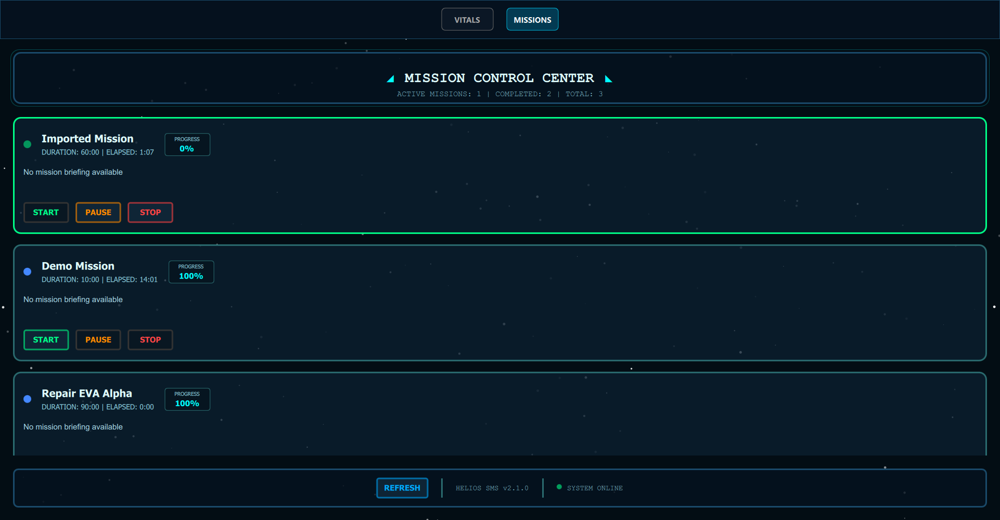
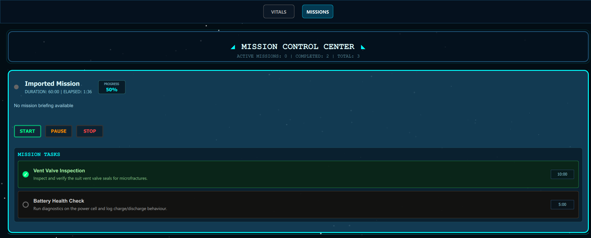

"# Helios - Suit Monitoring System (SMS) 🚀

**Helios SMS** is an advanced spacesuit telemetry monitoring and mission management system designed for space exploration missions. Built with Python and PySide6/Qt, it provides real-time monitoring of spacesuit vitals, mission tracking, and safety alert management.


## 🌟 Features

### 📊 Real-time Telemetry Monitoring
- **Vital Signs Tracking**: Monitor critical spacesuit parameters in real-time
  - Oxygen (O2) levels with percentage display
  - Carbon Dioxide (CO2) concentration monitoring  
  - Battery power levels with visual indicators
  - Internal and external temperature readings
  - Suit leak detection and alerts
- **Visual Dashboard**: Intuitive gauge-style displays with color-coded status indicators
- **Warning System**: Automated alerts for critical values with audio notifications
- **Historical Data**: Real-time graphing and trend analysis


### 🎯 Mission Management System
- **Mission Planning**: Manage detailed mission profiles
- **Task Management**: Break down missions into individual tasks with:
  - Time estimates and tracking
  - Progress monitoring
  - Completion status
  - Detailed descriptions
- **Mission Control**: Start, pause, and resume missions with elapsed time tracking
- **Progress Tracking**: Visual progress bars and completion percentages





### ⚠️ Safety & Alert System
- **Real-time Warnings**: Automatic detection of hazardous conditions
- **Audio Alerts**: Configurable sound notifications for critical alerts
- **Warning Management**: Acknowledge and track warning status
- **Multi-level Alerts**: Different severity levels for various conditions
- **Alert History**: Track and review past warnings and incidents

### 🔧 Suit Simulation
- **Realistic Data Simulation**: Generate realistic telemetry data for testing
- **Configurable Scenarios**: Simulate various mission conditions
- **Emergency Situations**: Test response to critical system failures

### 🌐 MQTT Integration
- **Multi-Protocol Communication**: MQTT-based real-time messaging for multiple data streams:
  - **Telemetry Data**: Real-time spacesuit sensor readings and vitals
  - **Mission Commands**: Remote mission control and task management
  - **Mission State**: Live mission status updates and synchronization
- **Scalable Architecture**: Support for multiple suit connections and ground stations
- **Reliable Messaging**: Robust message delivery and error handling
- **Topic Management**: Organized data channels with clear separation of concerns

## 🏗️ Architecture

### Backend Components
- **`main.py`**: Application entry point and Qt integration
- **`telemetry/`**: Real-time telemetry processing and data models
- **`mission/`**: Mission and task management system
- **`alert_manager.py`**: Safety warning and notification system
- **`simulator/`**: Suit data simulation for testing and development
- **`mqtt/`**: MQTT client and communication handling
- **`common/`**: Shared utilities and configuration

### Frontend (QML/Qt Quick)
- **`main.qml`**: Primary application window and navigation
- **`views/TricorderView.qml`**: Telemetry monitoring interface
- **`views/MissionView.qml`**: Mission management interface
- **`components/`**: Reusable UI components including:
  - `VitalsDial.qml`: Gauge-style telemetry displays
  - `SpaceMissionCard.qml`: Mission overview cards
  - `TaskItem.qml`: Individual task management
  - `WarningDisplay.qml`: Alert and warning components

## 🚀 Getting Started

### Prerequisites
- Python 3.8+
- Qt 6.0+
- paho-mqtt

### Installation

1. **Clone the repository**
   ```bash
   git clone https://github.com/suheda-snr/helios_sms.git
   cd helios_sms
   ```

2. **Install dependencies**
   ```bash
   pip install -r requirements.txt
   ```

3. **Running the Suit Simulator**

    This will generate realistic telemetry data that the main application can monitor.

    ```bash
    cd backend/simulator
    python suit_simulator.py
    ```

4. **Run the application**
   ```bash
   python backend/main.py
   ```


## 📋 Dependencies

- **PySide6**: Qt framework for Python GUI development
- **paho-mqtt**: MQTT client library for real-time communication
- **Python Standard Library**: json, threading, logging, pathlib

## 🎮 Usage

### Monitoring Telemetry
1. Launch the application
2. Switch to the "VITALS" tab
3. Monitor real-time spacesuit parameters
4. Acknowledge any warnings that appear

### Managing Missions
1. Switch to the "MISSION" tab
2. Select a mission from the available list
3. Start the mission to begin time tracking
4. Mark tasks as completed as they are finished
5. Monitor overall mission progress


## 🔧 Configuration

### MQTT Settings
- Default broker: `localhost:1883`
- **Communication Topics**:
  - `tricorder/telemetry` - Spacesuit sensor data
  - `tricorder/mission/commands` - Remote mission control
  - `tricorder/mission/state` - Mission status updates
- Configurable in `backend/common/topics.py`

### Mission Data
- Mission definitions stored in `backend/mission/missions.json`
- Fully customizable mission parameters and tasks
- Persistent storage of mission progress


---

**Helios SMS** - Keeping astronauts safe, one telemetry reading at a time. 🌌" 